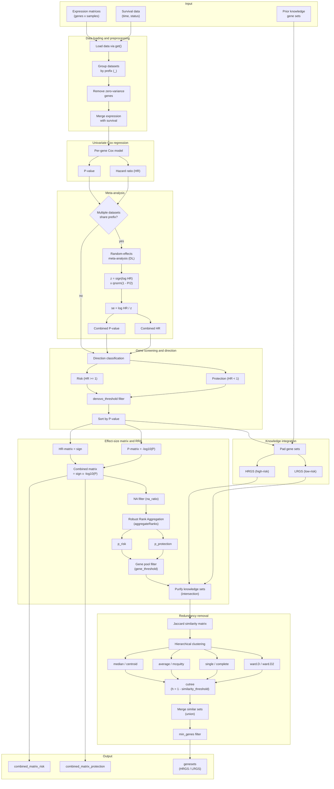

# Prognoser

A unified, direction-aware framework for discovering robust prognostic gene
signatures from multi-cohort, multi-endpoint survival data.

## Highlights

- **Direction-aware modeling.** Prognoser resolves low-risk (protective) and
  high-risk (risk) signatures separately, preserving the biological direction
  of every gene-survival association rather than collapsing it into a single
  direction-agnostic score.
- **Multi-cohort, multi-endpoint integration.** OS, RFS, PFS, and DFS are
  jointly analyzed within each dataset and meta-analyzed across cohorts,
  markedly increasing statistical power, stability, and cross-study
  generalizability.
- **Evidence fusion.** A signed effect-size matrix (direction x `-log10(P)`)
  is combined with robust rank aggregation (RRA) to prioritize genes that are
  reproducibly associated with outcome.
- **Knowledge-guided discovery.** Prior pathway gene sets are seamlessly
  incorporated into the candidate pool, bridging data-driven and
  hypothesis-driven analyses.
- **Redundancy-aware consolidation.** Jaccard-similarity clustering removes
  redundant signatures and returns a compact, interpretable panel ready for
  downstream validation and clinical translation.

## What is Prognoser?

A **prognostic gene signature** is a set of genes whose expression is
associated with patient survival. `Prognoser` identifies two kinds of genes:

- **Risk genes** (hazard ratio HR > 1): higher expression means worse
  survival.
- **Protective genes** (hazard ratio HR < 1): higher expression means better
  survival.

Unlike conventional single-dataset or undirected approaches, `Prognoser`
explicitly resolves effect direction and integrates multiple studies into a
curated, non-redundant set of signatures.

## How it works

`Prognoser` runs the following steps:

1. **Load data.** Read one expression matrix per dataset-endpoint, plus the
   matching survival data (`time` and `status`).
2. **Univariate Cox regression.** For every gene, fit a Cox model to estimate
   its hazard ratio (HR) and p-value.
3. **Screen genes.** Keep protective genes (HR < 1) and risk genes (HR >= 1)
   that pass a p-value threshold, preserving effect direction.
4. **Meta-analysis.** When several endpoints or datasets share the same prefix
   (for example `SimDataA_OS`, `SimDataA_RFS`, ...), combine their results
   with a random-effects meta-analysis.
5. **Robust rank aggregation.** Build a signed combined effect matrix and rank
   genes with the RRA method to select stable genes.
6. **Add prior knowledge.** Merge user-provided gene sets into the candidate
   pool.
7. **Remove redundancy.** Cluster gene sets by Jaccard similarity and keep
   non-redundant sets with enough genes.
8. **Return.** A list of final high-risk (`HRGS`) and low-risk (`LRGS`)
   signatures, plus the combined effect matrices.

## Pipeline overview



## Quick start (fresh R environment)

This assumes a new R session with no packages installed. Run the following to
install everything:

```r
# Core statistical dependencies
install.packages(c("survival", "RobustRankAggreg", "meta"))

# Prognoser
install.packages("remotes")
remotes::install_github("FangZY-Lab/Prognoser")

library(Prognoser)
```

`meta` will automatically install a few additional packages (`metafor`,
`metabook`, `metadat`, `CompQuadForm`); that is expected.

Then continue with the simulated-data example below.

## Data format

`Prognoser()` reads data from the global environment via `get()`. Each entry in
`expression_accession_vector` is a dataset-endpoint name such as `SimDataA_OS`,
and it must come with two data frames:

- Expression data frame: named exactly like the entry (for example
  `SimDataA_OS`), with genes as rows and samples as columns.
- Survival data frame: named `<entry>_survival` (for example
  `SimDataA_OS_survival`), with numeric columns `time` and `status` (`0` =
  alive, `1` = dead). Its row names must match the column names of the
  expression data frame.

Entries that share the same prefix before `_` (for example `SimDataA_OS`,
`SimDataA_RFS`, `SimDataA_PFS`, `SimDataA_DFS`) are grouped and meta-analyzed
as one dataset.

## Simulated data

The code below simulates three datasets (`SimDataA`, `SimDataB`, `SimDataC`).
Each dataset has one expression profile and four prognostic endpoints (`OS`,
`RFS`, `PFS`, `DFS`). To make the result easy to interpret, we plant 10 "risk"
genes (`GENE1`-`GENE10`, higher expression -> worse survival) and 10
"protective" genes (`GENE11`-`GENE20`, higher expression -> better survival).

```r
set.seed(123)

endpoints <- c("OS", "RFS", "PFS", "DFS")

make_dataset <- function(n_samples = 80, n_genes = 100, seed = 1) {
  set.seed(seed)

  # Latent risk score: higher score -> worse survival
  risk_score <- rnorm(n_samples)

  # Expression matrix: genes as rows, samples as columns
  mat <- matrix(rnorm(n_samples * n_genes), nrow = n_genes, ncol = n_samples)

  # First 10 genes are risk genes (positively correlated with risk_score)
  mat[1:10, ] <- mat[1:10, ] + matrix(rep(risk_score * 2, each = 10), nrow = 10)

  # Genes 11-20 are protective genes (negatively correlated with risk_score)
  mat[11:20, ] <- mat[11:20, ] - matrix(rep(risk_score * 2, each = 10), nrow = 10)

  expr <- as.data.frame(mat)
  rownames(expr) <- paste0("GENE", seq_len(n_genes))
  colnames(expr) <- paste0("S", seq_len(n_samples))

  make_surv <- function(risk_score, ep_seed) {
    set.seed(ep_seed)
    eps <- rnorm(length(risk_score), 0, 0.3)
    time <- rweibull(length(risk_score), shape = 1, scale = exp(2 - risk_score + eps))
    status <- rbinom(length(risk_score), 1, 0.7)
    data.frame(
      time = round(time, 3),
      status = status,
      row.names = paste0("S", seq_along(risk_score))
    )
  }

  list(
    expr = expr,
    OS = make_surv(risk_score, seed * 10 + 1),
    RFS = make_surv(risk_score, seed * 10 + 2),
    PFS = make_surv(risk_score, seed * 10 + 3),
    DFS = make_surv(risk_score, seed * 10 + 4)
  )
}

dA <- make_dataset(seed = 11)
dB <- make_dataset(seed = 22)
dC <- make_dataset(seed = 33)

# Expose every dataset-endpoint pair in the global environment with the
# expected naming convention: <Dataset>_<Endpoint> and <Dataset>_<Endpoint>_survival
for (ds in c("A", "B", "C")) {
  d <- get(paste0("d", ds))
  for (ep in endpoints) {
    assign(paste0("SimData", ds, "_", ep), d$expr)
    assign(paste0("SimData", ds, "_", ep, "_survival"), d[[ep]])
  }
}
```

## Run

```r
datasets <- c(
  "SimDataA_OS", "SimDataA_RFS", "SimDataA_PFS", "SimDataA_DFS",
  "SimDataB_OS", "SimDataB_RFS", "SimDataB_PFS", "SimDataB_DFS",
  "SimDataC_OS", "SimDataC_RFS", "SimDataC_PFS", "SimDataC_DFS"
)

# Prior / knowledge gene sets (at least 10 in this example)
knowledge <- list(
  immune_response = c("GENE1", "GENE2", "GENE3", "GENE11"),
  cell_cycle = c("GENE4", "GENE5", "GENE6"),
  apoptosis = c("GENE7", "GENE8", "GENE14"),
  dna_repair = c("GENE9", "GENE10", "GENE15"),
  metabolism = c("GENE11", "GENE12", "GENE13"),
  angiogenesis = c("GENE16", "GENE17", "GENE18"),
  inflammation = c("GENE19", "GENE20", "GENE1"),
  proliferation = c("GENE2", "GENE4", "GENE6", "GENE8"),
  signaling = c("GENE3", "GENE5", "GENE7", "GENE9"),
  epithelial = c("GENE10", "GENE12", "GENE14", "GENE16")
)

result <- Prognoser(
  expression_accession_vector = datasets,
  knowledge_genesets = knowledge,
  denovo_threshold = 0.05,
  gene_threshold = 0.01,
  min_genes = 3,
  similarity_threshold = 0.5,
  linkage = "ward.D"
)

# Final non-redundant gene sets
str(result$genesets)

# Combined effect matrices for the protective / risk directions
head(result$combined_matrix_protection)
head(result$combined_matrix_risk)
```

If the demo works, `result$genesets$HRGS1` should contain the planted risk
genes (`GENE1`-`GENE10`) and `result$genesets$LRGS1` the planted protective
genes (`GENE11`-`GENE20`).

The example uses `gene_threshold = 0.01` and `min_genes = 3` to keep the demo
output stable; adjust them as needed. Defaults are listed below.

## Arguments

| Argument | Description | Default |
| --- | --- | --- |
| `expression_accession_vector` | Dataset-endpoint names; each must exist in the global environment together with `<name>_survival` | none |
| `denovo_threshold` | P-value threshold for univariate Cox screening (protective / risk genes) | `0.05` |
| `knowledge_genesets` | A `list` of prior gene sets (character vectors) | none |
| `na_ratio` | Maximum allowed proportion of missing values per gene across datasets | `0.3` |
| `gene_threshold` | P-value threshold from robust rank aggregation (RRA) | `0.001` |
| `min_genes` | Minimum number of genes in a final clustered gene set | `5` |
| `similarity_threshold` | Jaccard similarity threshold for clustering gene sets | `0.5` |
| `linkage` | Hierarchical clustering method; pass a single value (for example `"ward.D"`) | see note below |

## Return value

- `genesets`: final non-redundant gene sets. Low-risk (protective) sets are
  prefixed with `LRGS`, high-risk sets with `HRGS`.
- `combined_matrix_protection`: combined effect matrix (sign x `-log10(P)`) for
  protective-direction genes, including a `p_protection` column.
- `combined_matrix_risk`: combined effect matrix for risk-direction genes,
  including a `p_risk` column.

## Notes

1. **Pass a single value for `linkage`** (for example `"ward.D"`, `"average"`,
   or `"complete"`). The function's default is a vector of choices; omitting it
   will cause `hclust()` to error.
2. Data must be in the global environment and named exactly `<dataset>` and
   `<dataset>_survival`.
3. The meta-analysis step may print warnings from the `meta` package for some
   genes. These are non-fatal and can be ignored.

## Author

Dingkang Zhao (赵定康)

Email: <dingkang.25@intl.zju.edu.cn>
